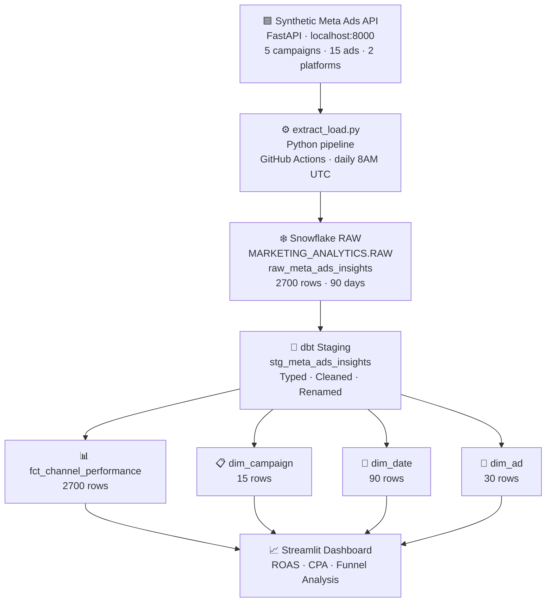

# Marketing Analyst Streaming Pipeline
**LMU ISBA 4715 | Alessia Berry**

A end-to-end analytics engineering pipeline that extracts synthetic paid social data modeled after the Meta Ads API, loads it to Snowflake, and transforms it with dbt into a star schema ready for dashboarding.

---

## Pipeline Architecture

---

## Tech Stack

| LSource | Synthetic Meta Ads API (FastAPI) |
| Orchestration | GitHub Actions |
| Data Warehouse | Snowflake |
| Transformation | dbt |
| Testing | dbt tests (18 passing) |
| Dashboard | Streamlit (Milestone 02) |

---

## Project Structure
