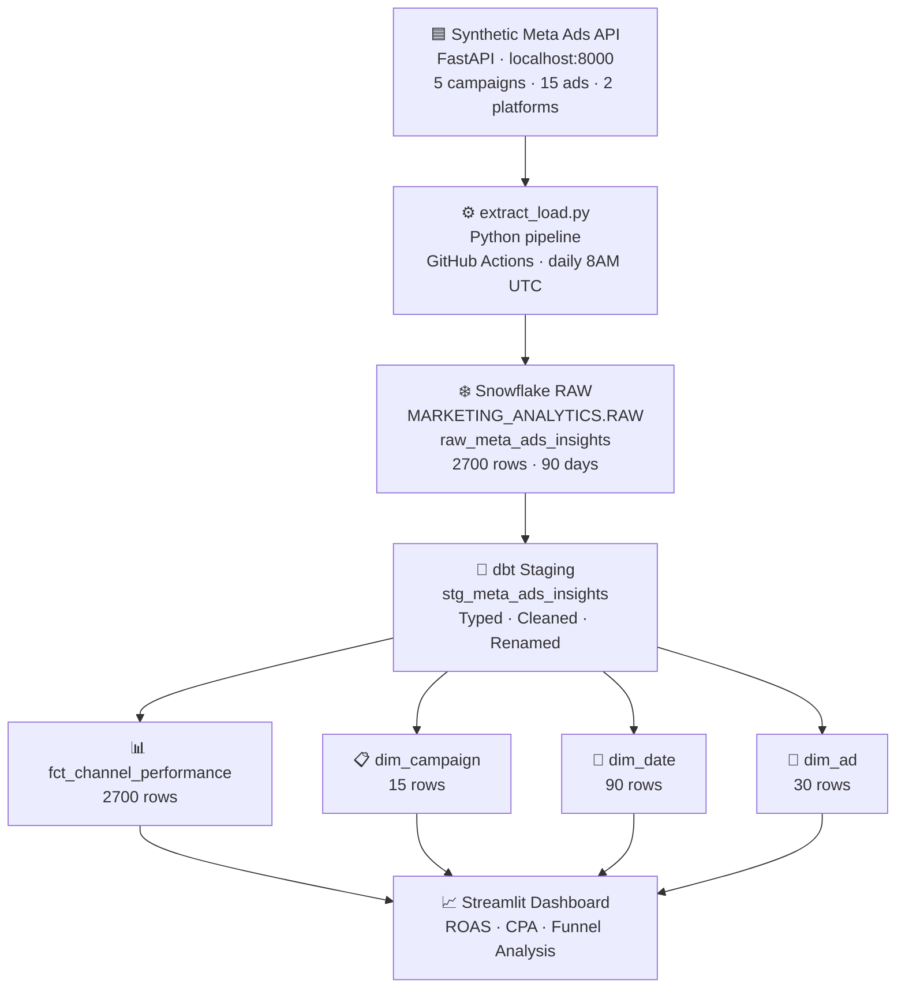
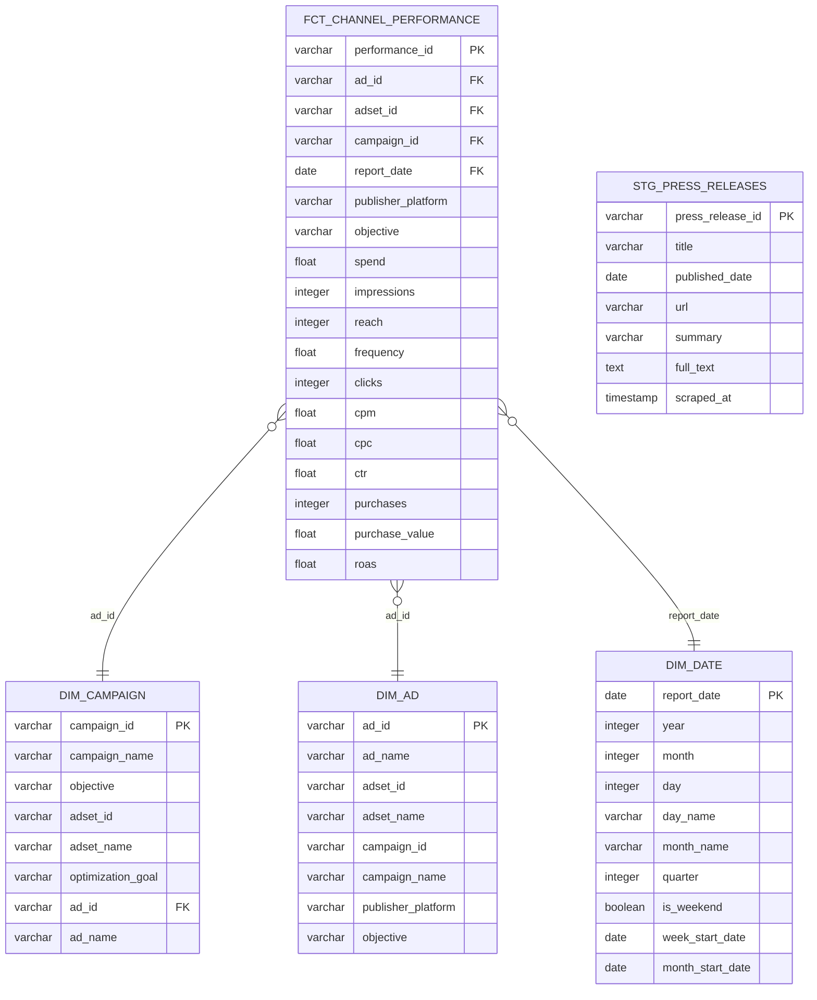

# Marketing Analyst Streaming Pipeline
**LMU ISBA 4715 | Alessia Berry**

A end-to-end analytics engineering pipeline that extracts synthetic paid social data modeled after the Meta Ads API, loads it to Snowflake, and transforms it with dbt into a star schema ready for dashboarding.

---

## Pipeline Architecture



---

## Entity Relationship Diagram (ERD)



---

## Tech Stack

| LSource | Synthetic Meta Ads API (FastAPI) |
| Orchestration | GitHub Actions |
| Data Warehouse | Snowflake |
| Transformation | dbt |
| Testing | dbt tests (18 passing) |
| Dashboard | Streamlit (Milestone 02) |

---

## Project Structure

## How to Run Locally

### 1. Start the API
```bash
cd api
pip3 install -r requirements-api.txt
uvicorn main:app --reload --port 8000
```

### 2. Run the pipeline
```bash
pip3 install -r requirements-pipeline.txt
export $(cat .env | xargs)
python3 extract_load.py

# Full 90-day backfill
python3 extract_load.py backfill
```

### 3. Run dbt
```bash
dbt deps
dbt run
dbt test
```

---

## Data Source

Synthetic data modeled after the real [Meta Ads Insights API](https://developers.facebook.com/docs/marketing-api/insights/), including:
- String-typed numeric metrics (matching real API behavior)
- Nested `actions`, `action_values`, `cost_per_action_type` arrays
- Cursor-based pagination
- `publisher_platform` breakdown (facebook / instagram)
- 5 Paramount+ campaigns across 15 ads over 90 days
