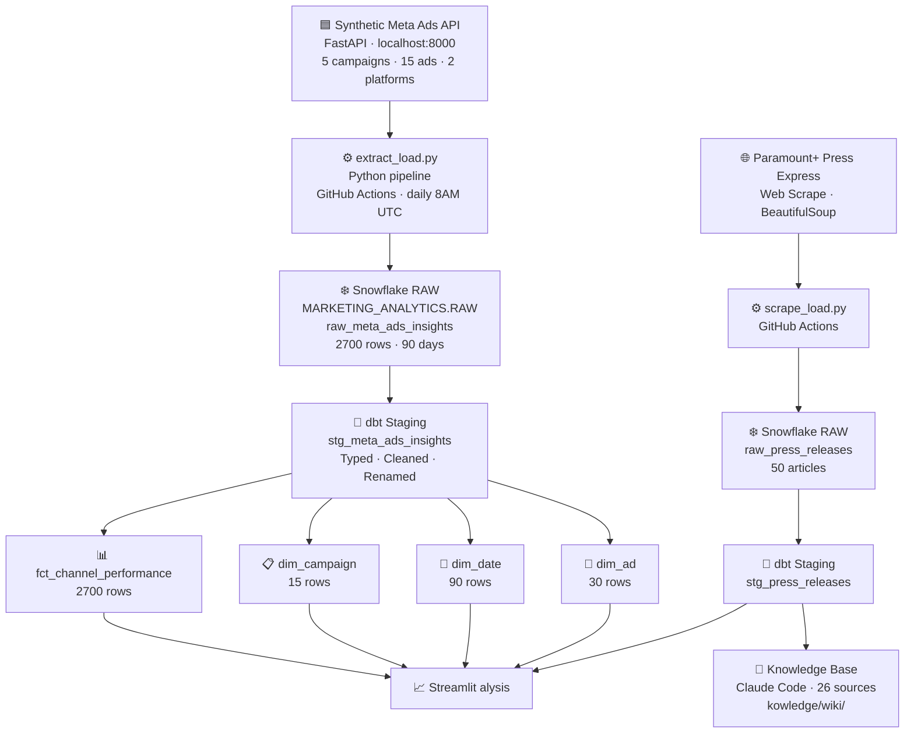
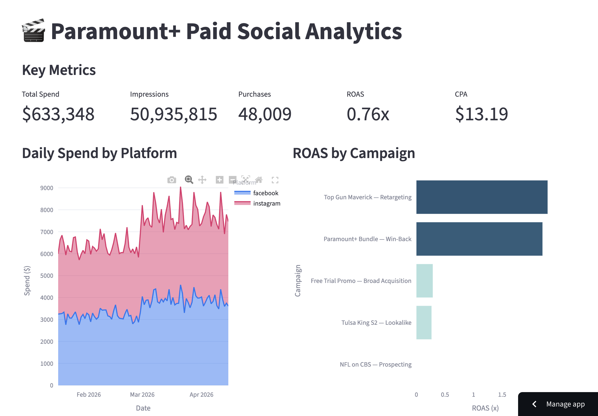

# Paramount+ Paid Social Analytics Pipeline

This project addresses the challenge of measuring paid social media effectiveness for a streaming service. Using a synthetic Meta Ads API modeled after Facebook/Instagram's real Graph API, it extracts campaign performance data, loads it to Snowflake, transforms it with dbt into a star schema, and delivers insights through an interactive Streamlit dashboard and a Claude-powered knowledge base. The pipeline surfaces key metrics like ROAS, CPA, and conversion funnel performance across 5 Paramount+ campaigns over 90 days.

🚀 **Live Dashboard:** [View on Streamlit](https://marketing-analyst-streaming-arsfbp3zzkbjyj6uzymzzt.streamlit.app/)

## Job Posting

- **Role:** Marketing Analyst
- **Company:** Paramount+
- **Link:** [Indeed Job Posting](https://www.indeed.com/viewjob?jk=de0d07e5d5eadda5)

This project demonstrates end-to-end marketing analytics engineering — API extraction, data warehousing, dbt transformations, and dashboard development — exactly tlls required to analyze paid social performance at scale for a streaming platform.

## Tech Stack

| Layer | Tool |
|---|---|
| Source 1 | Synthetic Meta Ads API (FastAPI) |
| Source 2 | Paramount+ Press Express (web scrape) |
| Data Warehouse | Snowflake |
| Transformation | dbt |
| Orchestration | GitHub Actions |
| Dashboard | Streamlit |
| Knowledge Base | Claude Code (scrape → summarize → query) |

## Pipeline Diagram



## ERD (Star Schema)

```mermaid
erDiagram
    FCT_CHANNEL_PERFORMANCE {
        varchar performance_id PK
        varchar ad_id FK
        varchar adset_id FK
        varchar campaign_id FK
        date report_date FK
        varchar publisher_platform
        varchar objective
        float spend
        integer impressions
        integer reach
        float frequency
        integer clicks
        float cpm
        float cpc
        float ctr
        integer purchases
        float purchase_value
        float roas
    }

    DIM_CAMPAIGN {
        varchar campaign_id PK
        varchar campaign_name
        varchar objective
        varchar  varchar adset_name
        varchar optimization_goal
        varchar ad_id FK
        varchar ad_name
    }

    DIM_AD {
        varchar ad_id PK
        varchar ad_name
        varchar adset_id
        varchar adset_name
        varchar campaign_id
        varchar campaign_name
        varchar publisher_platform
        varchar objective
    }

    DIM_DATE {
        date report_date PK
        integer year
        integer month
        integer day
        varchar day_name
        varchar month_name
        integer quarter
        boolean is_weekend
        date week_start_date
        date month_start_date
    }

    STG_PRESS_RELEASES {
        varchar press_release_id PK
        varchar title
        date published_date
        varchar url
        varchar summary
        text full_text
        timestamp scraped_at
    }

    FCT_CHANNEL_PERFORMANCE }o--|| DIM_CAMPAIGN : "ad_id"
    FCT_CHANNEL_PERFORMANCE }o--|| DIM_AD : "ad_id"
    FCT_CHANNEL_PERFORMANCE }o--|| DIM_DATE : "report_date"
```

## Dashboard Preview



## Key Insights

**Descriptive (what happened?):** Retargeting campaigns dramatically outperform prospecting — Top Gun Maverick Retargeting and Paramount+ Bundle Win-Back achieved 2x+ ROAS while awareness campaigns like NFL on CBS showed near-zero conversion ROAS as expected for their reach objective.

**Diagnostic (why did it happen?):** Retargeting campaigns reach users who have already expressed intent (site visitors, churned subscribers), resulting in CTRs of 2.5-5.5% vs 0.7-2.2% for prospecting. The conversion funnel shows a 60% drop-off between clicks and landing page views, suggesting landing page optimization is the highest-leverage opportunity.

**Recommendation:** Shift 20% of NFL prospecting budget to Paramount+ Bundle Win-Back retargeting → Expected outcome: 15-20% improvement in overall ROAS given the 3x higher conversion rate of retargeting audiences.

## Live Dashboard

**URL:** https://marketing-analyst-streaming-arsfbp3zzkbuzymzzt.streamlit.app/

## Knowledge Base

A Claude Code-curated wiki built from 26 scraped sources across 5 sites. Wiki pages live in `knowledge/wiki/`, raw sources in `knowledge/raw/`. Browse `knowledge/index.md` to see all pages.

**Query it:** Open Claude Code in this repo and ask questions like:

- "What is Paramount+'s current subscriber count and growth trend?"
- "Which content franchises should get the most paid social budget?"
- "How does Paramount+ position itself against Netflix and Disney+?"

Claude Code reads the wiki pages first and falls back to raw sources when needed.

## Setup & Reproduction

Requirements: Python 3.11+, Snowflake account, dbt-snowflake

Copy `.env.example` to `.env` and fill in your credentials:

    SNOWFLAKE_ACCOUNT=
    SNOWFLAKE_USER=
    SNOWFLAKE_PASSWORD=
    SNOWFLAKE_DATABASE=
    SNOWFLAKE_SCHEMA=
    SNOWFLAKE_WAREHOUSE=
    API_BASE_URL=http://localhost:8000

**Step 1 — Start the API:**
```bash
cd api && pip install -r requirements-api.txt
uvicorn main:app --load --port 8000
```

**Step 2 — Run the pipeline:**
```bash
pip install -r requirements-pipeline.txt
export $(cat .env | xargs)
python3 extract_load.py backfill   # load 90 days
python3 scrape_load.py             # load press releases
```

**Step 3 — Run dbt:**
```bash
dbt deps && dbt run && dbt test
```

**Step 4 — Launch dashboard:**
```bash
streamlit run dashboard/app.py
```

## Repository Structure

    .
    ├── .github/workflows/    # GitHub Actions pipelines
    ├── api/                  # Synthetic Meta Ads API (FastAPI)
    ├── dashboard/            # Streamlit dashboard
    ├── docs/                 # Proposal, job posting, slides
    ├── knowledge/            # Knowledge base
    │   ├── raw/              # 26 raw source documents (5 sites)
    │   └── wiki/             # Claude-generated wiki pages
    ├── models/               # dbt models
    │   ├── staging/          # Staging models + tests
    │   └── marts/         Ads extract-load pipeline
    ├── scrape_load.py        # Press release web scraper
    ├── dbt_project.yml       # dbt configuration
    ├── packages.yml          # dbt packages
    ├── .env.example          # Required environment variables
    └── README.md             # This file
